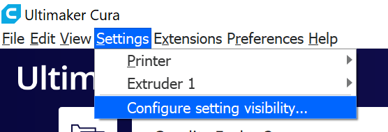
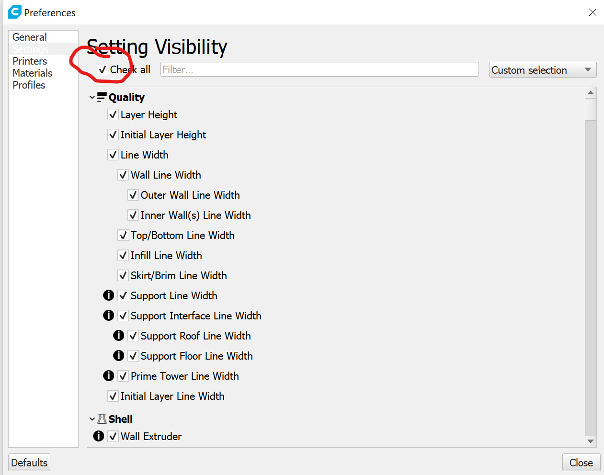

# Cruces Creatives 3d Printer Lab
## Creality Ender 3 Pro

## Software Setup

- [Download and install Ulitmaker Cura](https://ultimaker.com/software/ultimaker-cura)
- On setup, choose the "Creality Ender 3 Pro" as the printer profile
- Default settings are probably fine, but you can view all settings 
    - 
    - 
- [Bed Leveling Gcode can be found here](https://www.thingiverse.com/thing:3235018), although Xander just moves the x and y axes manually.
    - Use a piece of paper to adjust the bed

## Possible Problems and Fixes

[Look here](https://www.matterhackers.com/articles/3d-printer-troubleshooting-guide), this may be helpful but Google is your friend.

